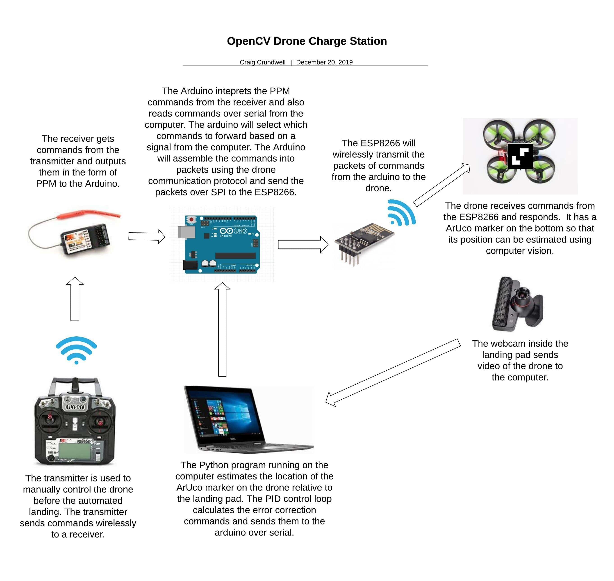

## Description  
An intelligent landing pad that can detect a drone flying overhead and take control to autonomously land the drone and recharge it. In this case, I am using an inexpensive indoor drone flown manually by a person before the autonomous landing procedure takes over control. In a commercial application, the drone would use other sensors to fly autonomous missions before the landing. I am focusing on just the landing portion of the problem.  

## Video  
YouTube Demo Video: https://www.youtube.com/watch?v=vQnh8SQZ9hY  

To fly a drone autonomously, you need to know the actual location of the drone and a target location. Most advanced drones use GPS to accomplish this. For cheaper indoor drones, they have no sense of location so we need to provide this information to the control system.  We selected computer vision to track the drone position because it is inexpensive compared to other sensor options. The AruCo library is used to estimate the location of a small tag on the bottom of the drone. A webcam is located in the landing pad to view the drone flying above.  

Once we know the actual location of the drone and a desired location, we need to give the drone instructions to fly it autonomously. The system must calculate the appropriate commands to make the drone correct its position errors and try reach the target location. We can determine these commands using a PID control loop. A PID control loop has multiple values that can finely tune how the drone should respond to errors in it's location. The tuning of these values is critical for the drone to respond correctly without overshooting or causing other bad behavior like oscillations.  

For each axis of the drone's movement, there are 3 values to adjust; P, I, and D. The P value is proportional and represents how far the drone is from the target. If the drone is very far from the target, it must react strongly to bring it back to the target. The I value is integral and represents the past or historic error in the system. If the drone has been away from the target for a while, it must react strongly to try bring it back. D is for derivative and represents the current rate of change. If the drone is currently moving toward the target, less correction is required than if it is moving away from the target. PID values are different for every unique system. For example a more heavy and sluggish drone may need higher correction values to tune the flight vs a lighter and nimble drone. Even factors such as the frame rate of the camera will change the system response.  

In this project a Python program is used to read the video frames from the webcam and estimate the location of the drone. The program calculates the commands to send the drone to correct for errors when the drone drifts away from the target location. The Python program sends the commands over serial to a connected Arduino. The Arduino interprets these commands and assembles packets and transmits them to the drone using an Esp8266 module.  

Because we also need a way for the user to fly the drone before the landing pad takes control, there is a connected receiver to the Arduino that can forward commands from a user transmitter (controller). The Arduino can toggle between sending the commands from the computer, or commands from the users transmitter. This allows control of the drone to toggle between manual or autonomous flight.  

When the user flies the drone over the landing pad, the computer vision will detect the drone and the Python program tells the Arduino that it is taking over control. The Python program will set a target location and estimate the drone location. It will perform error calculations and send the drone commands to correct the position. When the Python program takes over control, the Arduino turns on the lights to allow the camera to more reliably track the drone location. The program hovers the drone for a few seconds to stabilize it before slowly lowering to the landing pad surface. Once the drone gets very close to the surface it experiences significantly increased lift called ground effect. The nearby ground increases the efficiency of the lift and causes the drone to bounce unless the throttle is dropped significantly. The PID loop is unable to handle this new system response so it fails to land the drone smoothly at this height. Instead, the throttle is lowered significantly for a short while before being turned off. This allows for a smoother landing.  

Once the drone has landed on the pad, it needs to doc with the charger. The drone is given gentle throttle and backward command so it slides backward and is physically guided into the charging dock. Magnets connect with small wires on the drone to transfer power and charge the battery.  

The Arduino can read the state of an LED on the charger which indicates if the it is still charging. The Arduino will fade the LED lights to indicate that the drone is charging. The charge is done when the lights turn off.  

When the charging is finished, the user can toggle a switch to make the landing pad physically disconnect the drone from the magnets and allow the drone to take off. The user performs the take off because it is difficult for an inexperienced user to take control of a drone already in flight. The reaction for adjusting the throttle must be very quick to prevent the drone from dropping of climbing too rapidly. Because of this, the computer has no problem reacting to taking control from a user smoothly but the reverse is challenging for the user.  

## Hardware
- Eachine E010 quadcopter 
- Arduino Uno 
- 2.4GHz nRF24L01+ 
- PlayStation Eye webcam  
- Flysky i6 transmitter 
- Flysky PPM compatible receiver  
- 12V power supply  
- 12V to 5V voltage converter 
- Windows 10 laptop

## Software
- Python 3.6 32bit  
- OpenCV contrib 4.1.2 
- Arduino 1.8.10
- CL Eye Driver 5.3.0.0341
- CL Eye Platform SDK 1.6.4.0028  

## Credit  
- Rotation matrix to euler angles math: https://www.learnopencv.com/rotation-matrix-to-euler-angles/   
- Inspiration and PID loop framework from @partomatl: https://github.com/partomatl   
- Signal filtering from @partomatl : https://github.com/partomatl   
- Transmitter protocol from goebish on RCgroups / github: https://github.com/goebish/nrf24_multipro  
- Serial communication modification of transmitter protocol from @perrytsao:  https://github.com/perrytsao  
- The PPM library @Nikkilae: https://github.com/Nikkilae/PPM-reader  

## TroubleShooting 
- A driver and SDK is required to run the play station camera on windows. The SDK package includes a test program which is useful to test the connection to the camera. Sometimes the camera needs to be moved to a different USB port and re selected in the test program to function properly. If the landing base does not react to the drone flying overhead, test the connection with the test program. 
- Avoid using the base with bright lights directly overhead as they can make it more difficult for the camera to detect the drone 
- Make sure the Aruco tracker on the bottom of the drone is not significantly bent or worn away. Replace it with a fresh one if required. 
- If the drone drifts a bit and does not fly level, the small trims buttons can be used to adjust for level flight  
- If the drone drifts significantly during flight, place it on a level surface and move both sticks to the bottom middle to re calibrate the on board sensors   
- If the system is drastically changed, the PID values may need to be tuned again. Start with the last known working values and adjust each P, I, or D value up or down slightly and monitor the system response. The pitch and roll can be tuned together if the system response is the same on both axis's (for a square drone it is usually the same). For common systems like the flight controller for a drone, the tuning process is well documented and online help can provide some rules of thumb to help speed up the process. For a less known system like this project the tuning is more guess and check. It is slow and frustrating but currently it is the only way.

